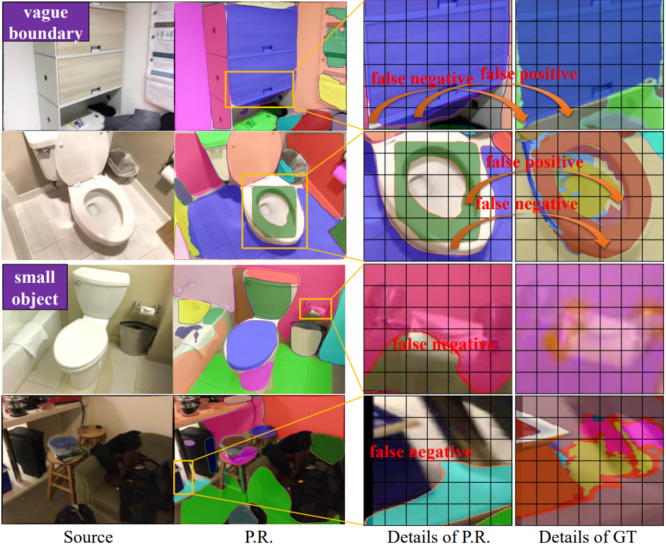
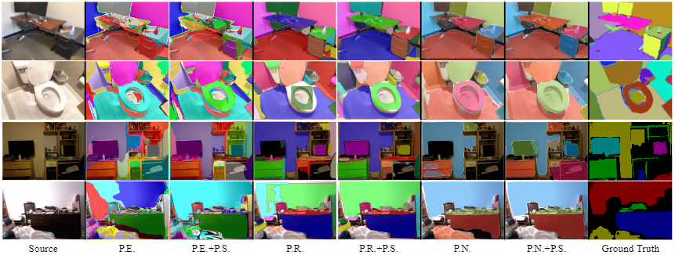
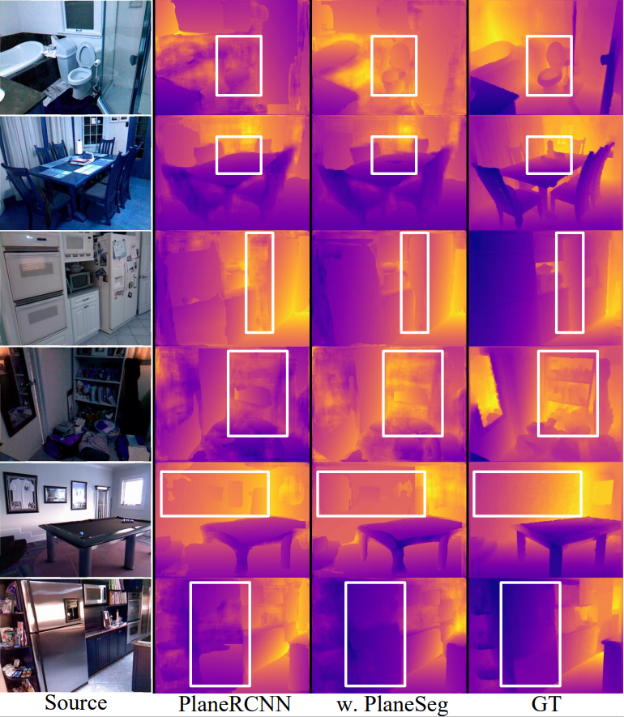
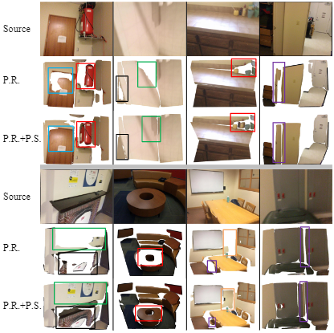
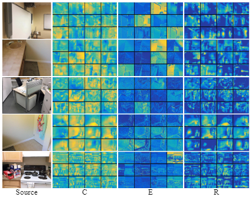

<div align="center">

# PlaneSeg: Building a Plug-in for Boosting Planar Region Segmentation [TNNLS2023]


<i>Zhicheng Zhang, Song Chen, Zichuan Wang, and Jufeng Yang</i>

<a href=" "></a>
[](https://cis.ieee.org/publications/t-neural-networks-and-learning-systems)
[](./LICENSE)

</div>

This is the official implementation of our **TNNLS 2023** paper.  </br>

## Publication

>**PlaneSeg: Building a Plug-in for Boosting Planar Region Segmentation**<br>
Zhicheng Zhang, Song Chen, Zichuan Wang, Jufeng Yang<br>
<i>IEEE Transactions on Neural Networks and Learning Systems (TNNLS)</i>.</br>
[[Paper]](https://ieeexplore.ieee.org/document/10097456) [[PDF]](./assests/final.pdf)</br>


## Abstract


Existing methods in planar region segmentation suffer the problems of vague boundaries and failure to detect small-sized regions. To address these, this study presents an end-to-end framework, named PlaneSeg, which can be easily integrated into various plane segmentation models. Specifically, PlaneSeg contains three modules, namely the edge feature extraction module, the multi-scale  module, and the resolution-adaptation module. First, the edge feature extraction module produces edge-aware feature maps for finer segmentation boundaries. The learned edge information acts as a constraint to mitigate inaccurate boundaries. Second, the multi-scale  module combines feature maps of different layers to harvest spatial and semantic information from planar objects. The multiformity of object information can help recognize small-sized objects to produce more accurate segmentation results. Third, the resolution-adaptation module fuses the feature maps produced by the two aforementioned modules. For this module, a pair-wise feature fusion is adopted to resample the dropped pixels and extract more detailed features. Extensive experiments demonstrate that PlaneSeg outperforms other state-of-the-art approaches on three downstream tasks, including plane segmentation, 3D plane reconstruction, and depth prediction.


## Running

You can easily train and evaluate the model by running the script below.


***Installation***: Please clone the repository, prepare enviroment, and compile corresponding packages. 

1. Clone repository
```
git clone https://github.com/nku-zhichengzhang/PlaneSeg.git
```
2. Create an Anaconda environment and install the dependencies

```
conda create --name ps
conda activate ps
conda install -y pytorch=0.4.1
conda install pip
pip install -r requirements.txt
```
3. compile `.cu` files. Details can be refered in [`PlaneRCNN`](https://github.com/NVlabs/planercnn).
```cd nms/src/cuda/
nvcc -c -o nms_kernel.cu.o nms_kernel.cu -x cu -Xcompiler -fPIC -arch=[arch]
cd ../../
python build.py
cd ../


cd roialign/roi_align/src/cuda/
nvcc -c -o crop_and_resize_kernel.cu.o crop_and_resize_kernel.cu -x cu -Xcompiler -fPIC -arch=[arch]
cd ../../
python build.py
cd ../../
```


***Datasets***: The used datasets are provided in the homepage of [ScanNet](http://www.scan-net.org/) and [NYUv2](https://cs.nyu.edu/~silberman/datasets/nyu_depth_v2.html). Preparation of each dataset is as same as [`PlaneRCNN`](https://github.com/NVlabs/planercnn). 


***Hyperparameter***: You can adjust more details such as epoch, batch size, etc. Please refer to [`options.py`](./options.py) and [`config.py`](./config.py).


***Training***: We prepare the shell to run the training process.

```
python scripts/run_shell_train.py
```

***Evaluation***:

To evaluate the performance, please run:
```
python scripts/run_shell_test.py
```
To count the parameters of model, please run:
```
python eval_flop_param.py
```
To test the running time, please run:
```
python eval_fps_ours.py
```

***Visualization***: We provide the code for re-implementing experimental results in our paper.
1. Segmentation results: run `evaluate_PlaneSeg.py` and extract the images with the name of `{idx}_segmentation_0_final.png`.

<div align=center></div>

2. Depth Prediction: run `evaluate_PlaneSeg.py` and extract the npy files with the name of `{idx}_segmentation_0_final.png`. Then, the npy files can be visualized as the script of [`npy2png.py`](./scripts/npy2png.py).

<div align=center></div>

3. 3D plane Reconstruction: run `vis_3d_plane_rec.py` and extract the ply files with the name of `{idx}_model_0_final.ply`. Then, the ply files can be visualized via `open3d` as the script of [`ply2png.py`](./scripts/ply2png.py).

<div align=center></div>

4. Feature Visualization: run `vis_feature.py`.

<div align=center></div>


## Citation
If you find this repo useful in your project or research, please consider citing the relevant publication.

**Bibtex Citation**
````
@ARTICLE{Zhang2023PlaneSeg,
  author={Zhang, Zhicheng and Chen, Song and Wang, Zichuan and Yang, Jufeng},
  journal={IEEE Transactions on Neural Networks and Learning Systems}, 
  title={PlaneSeg: Building a Plug-In for Boosting Planar Region Segmentation}, 
  year={2023},
  volume={},
  number={},
  pages={1-15},
  }

````
